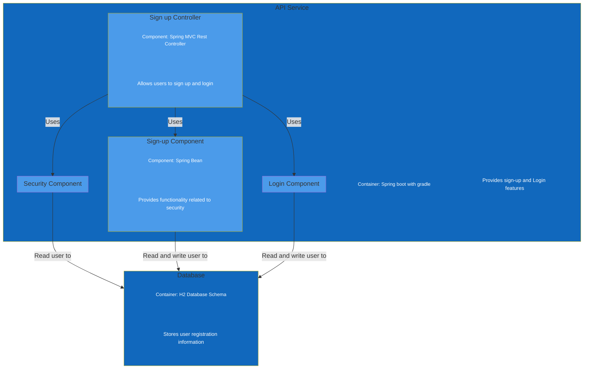

```mermaid

flowchart TB

    subgraph apiService[API Service]
        direction LR
        h3[Container: Spring boot with gradle]:::type
        d3[Provides sign-up and Login features]:::description
    end
    apiService:::internalContainer
    
    subgraph database[Database]
        direction LR
        h6[Container: H2 Database Schema]:::type
        d6[Stores user registration information]:::description
    end
    database:::internalContainer


    subgraph apiService[API Application]

        subgraph signUpController[Sign up Controller]
            direction LR
            h10[Component: Spring MVC Rest Controller]:::type
            d10[Allows users to sign up and login]:::description
        end
        signUpController:::internalComponent

        subgraph signUpPort[Sign-up Component]
            direction LR
            h40[Component: Service that provides sign up method]:::type
            d40[Provides functionality related to signing up]:::description
        end
        signUpPort:::internalComponent

        subgraph loginPort[Login Component]
            direction LR
            h40[Component: Service that provides login method]:::type
            d40[Provides functionality related to login]:::description
        end
        loginPort:::internalComponent

        subgraph securityComponent[Security Component]
            direction LR
            h40[Component: Spring Bean]:::type
            d40[Provides functionality related to security]:::description
        end
        securityComponent:::internalComponent


        signUpController--Uses-->securityComponent
        signUpController--Uses-->signUpPort
        signUpController--Uses-->loginPort
    end

    securityComponent--Read user to -->database
    signUpPort--Read and write user to -->database
    loginPort--Read and write user to -->database

%% Element type definitions

    classDef person fill:#08427b
    classDef internalContainer fill:#1168bd
    classDef internalComponent fill:#4b9bea

    classDef type stroke-width:0px, color:#fff, fill:transparent, font-size:12px
    classDef description stroke-width:0px, color:#fff, fill:transparent, font-size:13px

```