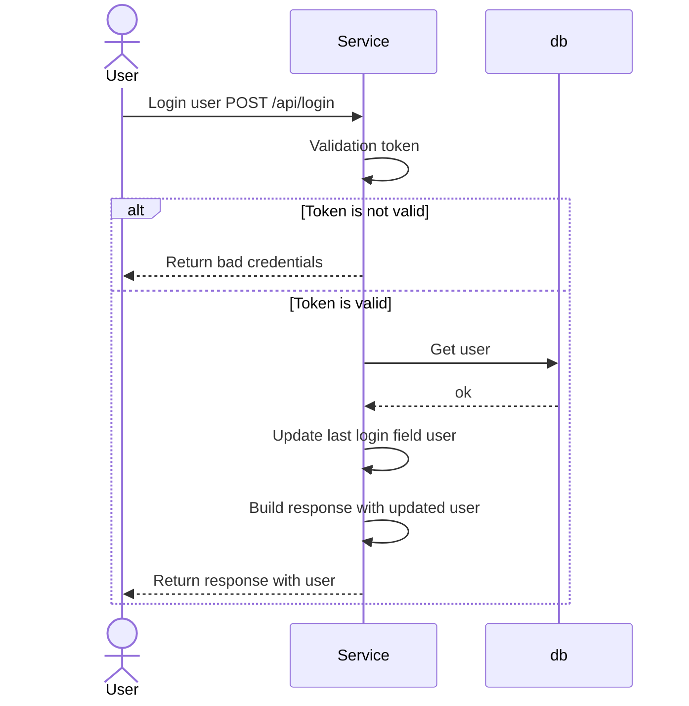

## Login

```mermaid
sequenceDiagram
    actor user as User
    participant app as Service
    user->>app: Login user POST /api/login
    app->>app: Validation token
    alt Token is not valid
        app -->> user: Return bad credentials
    else Token is valid
        app->>db: Get user
        db -->>app: ok
        app->>app: Update last login field user
        app->>app: Build response with updated user
        app-->>user: Return response with user
    end
    


```