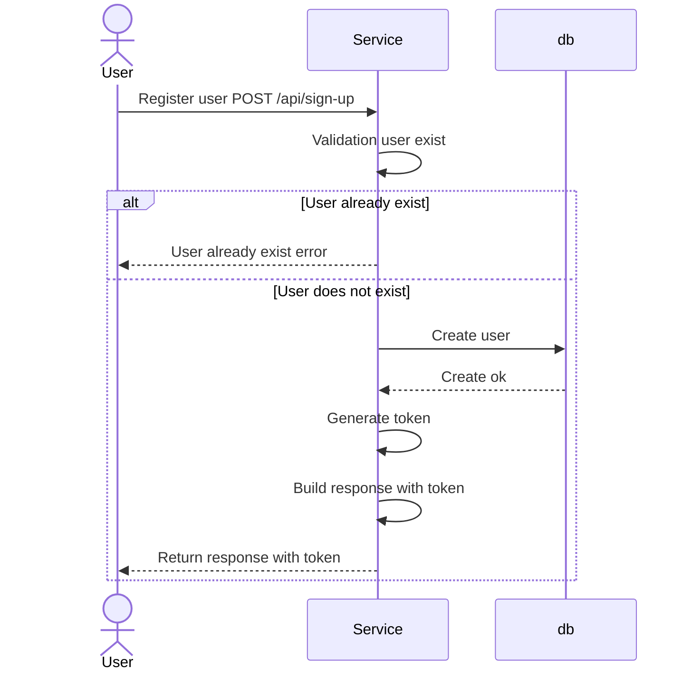

## Sign up

```mermaid
sequenceDiagram
    actor user as User
    participant app as Service
    user->>app: Register user POST /api/sign-up
    app->>app: Validation user exist
    alt User already exist
        app -->> user: User already exist error
    else User does not exist
        app->>db: Create user
        db -->>app: Create ok
        app->>app: Generate token
        app->>app: Build response with token
        app-->>user: Return response with token
    end
    


```